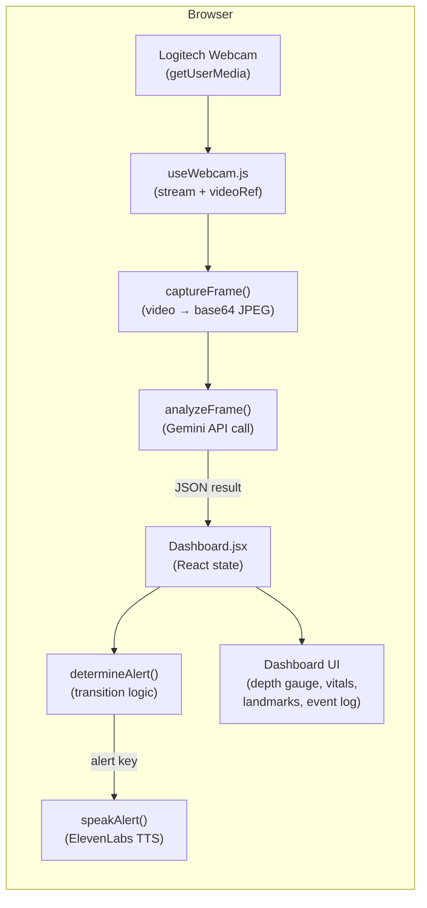

# NeoGuide — Project Structure

This document describes the directory layout, data flow, build system, dependencies, and environment configuration for the NeoGuide application.

## Directory Layout

```
NeoGuide/
├── .env                      # API keys (VITE_GEMINI_API_KEY, VITE_ELEVENLABS_API_KEY)
├── .env.example              # Template showing required env vars
├── .gitignore
├── index.html                # Vite HTML entry point
├── package.json              # Dependencies and scripts
├── vite.config.js            # Vite dev server and build config
├── README.md
├── guide.md                  # Original project guide / spec
├── Docs/                     # Agent-facing context documents (this folder)
│   ├── bug_tracking.md
│   ├── project_structure.md  # ← you are here
│   ├── implementation.md
│   └── UI.md
└── src/
    ├── main.jsx              # React entry point, global CSS injection
    ├── components/
    │   └── Dashboard.jsx     # Main (and currently only) page component
    ├── hooks/
    │   └── useWebcam.js      # Custom hook for webcam stream management
    └── services/
        ├── geminiVision.js   # Gemini Vision API integration + frame capture
        └── voiceAlerts.js    # ElevenLabs TTS integration + alert queue
```

### Folder conventions

| Folder | Purpose |
|---|---|
| `src/components/` | React components. Currently just `Dashboard.jsx`, which is the entire UI. New visual sections should become their own component file here. |
| `src/hooks/` | Custom React hooks that encapsulate browser/device APIs. `useWebcam.js` is the model to follow. |
| `src/services/` | Stateless modules that talk to external APIs. Each exports pure async functions; no React state inside. |
| `Docs/` | Context documents for AI agents and contributors. Not shipped to production. |

## Data Flow



### Step-by-step

1. **Webcam** — `useWebcam.js` calls `getUserMedia` and pipes the stream into a `<video>` element via `videoRef`.
2. **Frame capture** — Every 3 seconds, `Dashboard.jsx` calls `captureFrame(videoRef.current)` which draws the video onto a canvas and exports a base64 JPEG.
3. **AI analysis** — `analyzeFrame(base64, mimeType)` sends the image to Google Gemini with a structured prompt. Gemini returns JSON with landmarks, depth zone, safety status, guidance message, estimated depth, and image quality.
4. **State update** — The JSON result is stored in `analysis` state. The previous result is kept in `analysisRef` for transition comparison.
5. **Voice alerts** — `determineAlert(current, previous)` compares the two results. If a meaningful transition occurred (new landmark visible, zone change, safety change), it returns an alert key. `speakAlert(key)` queues and plays the corresponding ElevenLabs audio.
6. **UI render** — The Dashboard re-renders with updated depth gauge highlighting, landmark detection grid, vitals panel (animated toward targets based on safety status), event log entries, status badge, and AI guidance message.

## Build System

| Tool | Version | Role |
|---|---|---|
| Vite | 5.0.0 | Dev server and production bundler |
| @vitejs/plugin-react | 4.2.0 | JSX transform, fast refresh |

### Scripts

| Command | What it does |
|---|---|
| `npm run dev` | Starts Vite dev server on **port 3000**, auto-opens the browser |
| `npm run build` | Production build into `dist/` |
| `npm run preview` | Serves the production build locally for testing |

### Vite configuration (`vite.config.js`)

- React plugin enabled
- Dev server port: 3000
- `open: true` — auto-launches browser on `npm run dev`

## Dependencies

### Runtime

| Package | Version | Purpose |
|---|---|---|
| `react` | ^18.2.0 | UI framework |
| `react-dom` | ^18.2.0 | DOM renderer |
| `three` | ^0.160.0 | 3D rendering engine |
| `@react-three/fiber` | ^8.15.0 | React renderer for Three.js |
| `@react-three/drei` | ^9.92.0 | Helpers/abstractions for R3F |
| `@google/generative-ai` | ^0.21.0 | Google Gemini API client |
| `elevenlabs` | ^1.0.0 | ElevenLabs TTS (npm package, though the codebase uses direct fetch to the REST API) |

### Dev-only

| Package | Version | Purpose |
|---|---|---|
| `vite` | ^5.0.0 | Build tool |
| `@vitejs/plugin-react` | ^4.2.0 | React plugin for Vite |
| `@types/react` | ^18.2.0 | TypeScript types (IDE support) |

## Environment Variables

Stored in `.env` at the project root. **Never committed** (listed in `.gitignore`).

| Variable | Required | Description |
|---|---|---|
| `VITE_GEMINI_API_KEY` | Yes | Google Gemini API key for vision analysis |
| `VITE_ELEVENLABS_API_KEY` | Yes | ElevenLabs API key for TTS voice alerts |

All client-exposed env vars **must** be prefixed with `VITE_` — this is a Vite requirement. Variables without the prefix are not available in browser code.

## What is NOT in the Repo

The following items are referenced in `guide.md` but do not exist in this repository:

- **Raspberry Pi / TFLite code** — The edge inference proof-of-concept is a separate effort. Not part of the web dashboard codebase.
- **Training data / datasets** — BAGLS, Laryngoscope8, Vocal Folds, NBI-InfFrames, and CE-NBI datasets are stored externally (in a "GT Hackathon" folder). They are not checked in.
- **Pre-trained model files** — `.tflite` files are git-ignored.
- **Backend / database** — Supabase or Firebase logging is mentioned in the tech stack but not yet implemented. The current app is entirely client-side.
